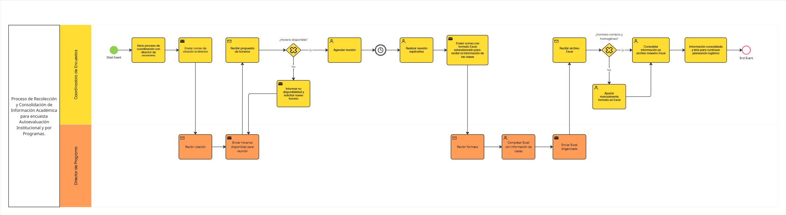

# Proyecto de Arquitectura Empresarial - Logística de Aplicación de la Encuesta de Autoevaluación

## Integrantes

| Nombre | Correo Electrónico |
|---|---|
| Valentina Alejandra López Romero | valentinalopro@unisabana.edu.co |
| Mariana Valle Moreno | marianavamo@unisabana.edu.co |
| Laura Camila Rodriguez Leon | laurarodleo@unisabana.edu.co |

## Contexto

Este proyecto se realiza para la clase de **Arquitectura Empresarial** y toma como caso de estudio un proceso real de la **Dirección de Desarrollo Estratégico** de la **Universidad de La Sabana**. En particular, se trabaja sobre la jefatura de **Cultura, Innovación y Servicio**, que es el área encargada de gestionar mediciones de percepción y satisfacción dentro de la universidad.

Dentro de esta jefatura, una de las tareas más importantes es la **Encuesta de Autoevaluación Institucional y por Programas**, ya que permite recoger la percepción de estudiantes, profesores y administrativos sobre distintos aspectos de la experiencia académica e institucional. Esta encuesta no es solo un ejercicio interno, sino que también aporta información valiosa para los procesos de calidad y mejora continua de la universidad.

Para este proyecto, el interés está centrado en la parte operativa de la encuesta, especialmente en la **recolección de información** y en la **logística de aplicación**. Actualmente, esta etapa exige mucho trabajo manual, porque la información llega en formatos poco estandarizados, se organiza principalmente en archivos de Excel y no existe una base de datos centralizada que facilite el control y la trazabilidad. Esto hace que el proceso sea más demorado, más dependiente del trabajo manual y más propenso a errores o reprocesos.

A partir de esta situación, el proyecto busca analizar el proceso actual y plantear una propuesta de mejora desde la **Arquitectura Empresarial**, con el fin de hacerlo más ordenado, eficiente y manejable, aprovechando mejor las herramientas que la universidad ya tiene disponibles.

## Desarrollo del análisis del proyecto

A continuación se presentan los principales elementos que se han desarrollado hasta el momento como parte del análisis del proyecto. Esta sección reúne los resultados construidos durante el trabajo, mostrando no solo qué se hizo, sino también qué permitió identificar cada entregable dentro del entendimiento del proceso actual.

### Contenido

- [1. Modelado BPMN](#1-modelado-bpmn)
- [2. Modelado ERD](#2-modelado-erd)
- [3. Mapa de Infraestructura y Diagnóstico Técnico](#3-mapa-de-infraestructura-y-diagnóstico-técnico)
- [4. Evaluación de Seguridad con STRIDE](#4-evaluación-de-seguridad-con-stride)
- [5. Cumplimiento Normativo](#5-cumplimiento-normativo)

---

## 1. Modelado BPMN

Se realizó el modelado del proceso actual utilizando notación **BPMN**, con el objetivo de representar de manera ordenada y visual cómo funciona hoy la recolección y consolidación de información académica para la **Encuesta de Autoevaluación Institucional y por Programas**.

Para construir este modelo se tomó como base el contexto entregado por el cliente y se delimitó el alcance del proceso desde el envío de la citación al director de programa hasta la recepción, validación y consolidación de la información académica necesaria para continuar con la planeación logística de la encuesta. A partir de ello, se identificaron actividades, responsables, decisiones, intercambios de información y reprocesos presentes en el flujo real.

### 1.1 Diagrama BPMN

A continuación se presenta el diagrama BPMN realizado para representar el proceso actual:

  

### 1.2 Análisis del BPMN

Como parte del análisis del proceso, se identificaron los principales actores y elementos de información que intervienen en el flujo:

| Nombre del elemento | Tipo | Descripción | Responsable |
|---|---|---|---|
| Coordinadora de Encuestas | Actor | Encargada de coordinar las citaciones, validar la información recibida y consolidar los datos finales del proceso. | Coordinadora de Encuestas |
| Director de Programa | Actor | Responsable de enviar su disponibilidad, participar en la coordinación y diligenciar la información académica solicitada. | Director de Programa |
| Formato Excel | Objeto de datos | Archivo enviado para diligenciar la información académica de cada programa. | Director de Programa |
| Excel Consolidado | Objeto de datos | Archivo maestro con la información validada y organizada para continuar con la planeación logística. | Coordinadora de Encuestas |

A partir de esta identificación, el diagrama permite entender con mayor claridad cómo se relacionan los dos actores principales del proceso: la **Coordinadora de Encuestas** y el **Director de Programa**. La coordinadora asume la responsabilidad de la coordinación general del flujo, incluyendo el envío de citaciones, la programación de reuniones, la validación de la información recibida y la consolidación final de los datos. Por su parte, el director de programa participa enviando su disponibilidad, asistiendo a la reunión de coordinación y diligenciando la información académica requerida para su programa.

También se puede observar que el proceso no depende únicamente de las personas involucradas, sino también del manejo de archivos como medio principal para intercambiar información. Más allá de describir actividades, el BPMN hace visibles varios puntos críticos del proceso actual. Uno de ellos es la dependencia del correo electrónico para coordinar acciones y compartir información. Otro aspecto importante es la presencia de decisiones que generan reprocesos, como ocurre cuando no hay disponibilidad para agendar la reunión o cuando el archivo recibido no cumple con un formato correcto y homogéneo. En estos casos, el proceso debe devolverse parcialmente, lo que aumenta el tiempo de ejecución y la carga operativa.

El modelo también permite evidenciar que gran parte del trabajo depende de revisiones manuales. La validación de la información académica no está automatizada, el formato de los archivos no siempre es consistente y la consolidación final requiere intervención directa de la coordinadora. Esto no solo hace el proceso más lento, sino que también incrementa el riesgo de errores, inconsistencias y pérdida de trazabilidad.

En conjunto, este análisis fue importante porque permitió aterrizar de manera visual el funcionamiento real del proceso, identificar sus actores, sus elementos de información y los principales cuellos de botella. Desde la perspectiva de **Arquitectura Empresarial**, el BPMN sirve como base para entender dónde están las mayores ineficiencias del flujo actual y sobre qué puntos conviene enfocar las propuestas de mejora en las siguientes etapas del proyecto.

---
## 2. Modelado ERD

---
## 3. Mapa de Infraestructura y Diagnóstico Técnico

---
## 4. Evaluación de Seguridad con STRIDE

---
## 5. Cumplimiento Normativo

Se realizó una evaluación de cumplimiento normativo sobre el sistema de la logística de aplicación de la **Encuesta de Autoevaluación Institucional y por Programas**, con el fin de identificar qué tan alineado se encuentra el proceso frente a marcos de referencia como **ISO 27001**, **GDPR**, **Habeas Data** y la **Ley 1581 de Protección de Datos Personales en Colombia**.

El análisis se centró en el proceso que soporta la planeación, coordinación y ejecución de la recolección de información académica para fines de autoevaluación y acreditación. Este proceso involucra el manejo de datos personales de estudiantes y profesores, así como información académica relacionada con materias, horarios y salones. Dado que actualmente la operación se apoya principalmente en archivos de Excel, correos electrónicos y en la interacción con un proveedor externo encargado de la recolección y anonimización de las respuestas, se consideró importante revisar si existen controles suficientes para proteger la información y cumplir con las exigencias normativas aplicables.

A partir de esta revisión, se buscó identificar las principales brechas de cumplimiento, los riesgos asociados al manejo actual de la información y las oportunidades de mejora que pueden fortalecer la seguridad, la integridad, la confidencialidad y el cumplimiento legal del proceso.

### 5.1 Resultado del checklist normativo

> Como resultado del taller no se realizó un diagrama visual formal, pero se construyó un checklist de evaluación y una tabla de brechas, identificando las dimensiones clave del cumplimiento normativo: protección de datos personales, seguridad de la información, gestión de datos y gobierno y roles, así como sus principales controles y brechas asociadas.

📊 Tabla de checklist y análisis de brechas: [tabla_checklist.xlsx](./diagramas/tabla_checklist.xlsx)

### 5.2 Análisis de cumplimiento normativo

Para estructurar el análisis, el modelo se organizó en cuatro dimensiones principales:

| Dimensión | Enfoque del análisis |
|---|---|
| Protección de datos personales | Revisión del tratamiento de datos personales, autorización del titular y mecanismos para ejercer derechos sobre la información. |
| Seguridad de la información | Evaluación de controles de acceso, validaciones, trazabilidad y protección frente a accesos no autorizados. |
| Gestión de datos | Revisión de la forma en que la información es capturada, almacenada, organizada y centralizada. |
| Gobierno y roles | Análisis de responsabilidades, control sobre actores involucrados y relación con terceros que participan en el proceso. |

A partir del checklist aplicado, se encontró que el proceso tiene algunos aspectos positivos, pero también varias oportunidades de mejora. Por ejemplo, antes de iniciar la encuesta se informa a los usuarios sobre el uso de sus datos y se solicita su autorización, lo cual es un punto favorable. Sin embargo, también se identificaron debilidades importantes, como la falta de un canal claro para que una persona pueda consultar, actualizar o eliminar su información, y la ausencia de controles más definidos sobre el acceso a los archivos utilizados durante la operación.

Otro hallazgo importante es que buena parte del proceso sigue dependiendo de herramientas manuales, especialmente archivos de Excel. Esto hace que el control de la información sea más difícil, porque no siempre queda claro quién accede a los archivos, quién realiza cambios o cómo se puede hacer seguimiento a una modificación. Además, como la información no está centralizada en un solo lugar, sino distribuida entre archivos y correos, aumenta la posibilidad de errores, duplicidad, pérdida de información y reprocesos.

En general, el análisis muestra que los riesgos no vienen solo del hecho de manejar datos personales, sino también de la manera en que el proceso está organizado hoy. Cuando la información depende de varios archivos sueltos, revisiones manuales y pocos controles de seguimiento, se vuelve más difícil garantizar orden, seguridad y cumplimiento.

Este entregable fue valioso porque permitió entender de forma más clara dónde están las principales brechas del proceso y qué aspectos deberían fortalecerse. Desde la perspectiva de **Arquitectura Empresarial**, este análisis ayuda a ver que mejorar el proceso no solo implica hacerlo más eficiente, sino también más confiable, más controlado y mejor preparado para responder a las exigencias normativas.

---
