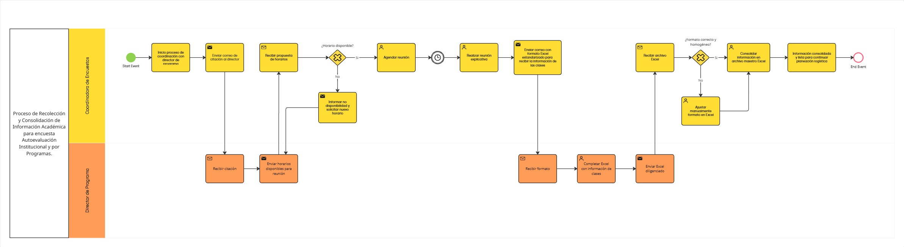

# Proyecto de Arquitectura Empresarial - Logística de Aplicación de la Encuesta de Autoevaluación

## Integrantes

| Nombre | Correo Electrónico |
|---|---|
| Valentina Alejandra López Romero | valentinalopro@unisabana.edu.co |
| Mariana Valle Moreno | marianavamo@unisabana.edu.co |
| Laura Camila Rodriguez Leon | laurarodleo@unisabana.edu.co |

## Contexto

Este proyecto se realiza para la clase de **Arquitectura Empresarial** y toma como caso de estudio un proceso real de la **Dirección de Desarrollo Estratégico** de la **Universidad de La Sabana**. En particular, se trabaja sobre la jefatura de **Cultura, Innovación y Servicio**, que es el área encargada de gestionar mediciones de percepción y satisfacción dentro de la universidad.

Dentro de esta jefatura, una de las tareas más importantes es la **Encuesta de Autoevaluación Institucional y por Programas**, ya que permite recoger la percepción de estudiantes, profesores y administrativos sobre distintos aspectos de la experiencia académica e institucional. Esta encuesta no es solo un ejercicio interno, sino que también aporta información valiosa para los procesos de calidad y mejora continua de la universidad.

Para este proyecto, el interés está centrado en la parte operativa de la encuesta, especialmente en la **recolección de información** y en la **logística de aplicación**. Actualmente, esta etapa exige mucho trabajo manual, porque la información llega en formatos poco estandarizados, se organiza principalmente en archivos de Excel y no existe una base de datos centralizada que facilite el control y la trazabilidad. Esto hace que el proceso sea más demorado, más dependiente del trabajo manual y más propenso a errores o reprocesos.

A partir de esta situación, el proyecto busca analizar el proceso actual y plantear una propuesta de mejora desde la **Arquitectura Empresarial**, con el fin de hacerlo más ordenado, eficiente y manejable, aprovechando mejor las herramientas que la universidad ya tiene disponibles.

## Desarrollo del análisis del proyecto

A continuación se presentan los principales elementos que se han desarrollado hasta el momento como parte del análisis del proyecto. Esta sección reúne los resultados construidos durante el trabajo, mostrando no solo qué se hizo, sino también qué permitió identificar cada entregable dentro del entendimiento del proceso actual.

### Contenido

- [1. Modelado BPMN](#1-modelado-bpmn)
- [2. Modelado ERD](#2-modelado-erd)
- [3. Mapa de Infraestructura y Diagnóstico Técnico](#3-mapa-de-infraestructura-y-diagnóstico-técnico)
- [4. Evaluación de Seguridad con STRIDE](#4-evaluación-de-seguridad-con-stride)
- [5. Cumplimiento Normativo](#5-cumplimiento-normativo)
- [6. Gobernanza](#6-gobernanza)
- [7. Análisis de Riesgos](#7-análisis-de-riesgos)

---

## 1. Modelado BPMN

Se realizó el modelado del proceso actual utilizando notación **BPMN**, con el objetivo de representar de manera ordenada y visual cómo funciona hoy la recolección y consolidación de información académica para la **Encuesta de Autoevaluación Institucional y por Programas**.

Para construir este modelo se tomó como base el contexto entregado por el cliente y se delimitó el alcance del proceso desde el envío de la citación al director de programa hasta la recepción, validación y consolidación de la información académica necesaria para continuar con la planeación logística de la encuesta. A partir de ello, se identificaron actividades, responsables, decisiones, intercambios de información y reprocesos presentes en el flujo real.

### 1.1 Diagrama BPMN

A continuación se presenta el diagrama BPMN realizado para representar el proceso actual:

  

### 1.2 Análisis del BPMN

Como parte del análisis del proceso, se identificaron los principales actores y elementos de información que intervienen en el flujo:

| Nombre del elemento | Tipo | Descripción | Responsable |
|---|---|---|---|
| Coordinadora de Encuestas | Actor | Encargada de coordinar las citaciones, validar la información recibida y consolidar los datos finales del proceso. | Coordinadora de Encuestas |
| Director de Programa | Actor | Responsable de enviar su disponibilidad, participar en la coordinación y diligenciar la información académica solicitada. | Director de Programa |
| Formato Excel | Objeto de datos | Archivo enviado para diligenciar la información académica de cada programa. | Director de Programa |
| Excel Consolidado | Objeto de datos | Archivo maestro con la información validada y organizada para continuar con la planeación logística. | Coordinadora de Encuestas |

A partir de esta identificación, el diagrama permite entender con mayor claridad cómo se relacionan los dos actores principales del proceso: la **Coordinadora de Encuestas** y el **Director de Programa**. La coordinadora asume la responsabilidad de la coordinación general del flujo, incluyendo el envío de citaciones, la programación de reuniones, la validación de la información recibida y la consolidación final de los datos. Por su parte, el director de programa participa enviando su disponibilidad, asistiendo a la reunión de coordinación y diligenciando la información académica requerida para su programa.

También se puede observar que el proceso no depende únicamente de las personas involucradas, sino también del manejo de archivos como medio principal para intercambiar información. Más allá de describir actividades, el BPMN hace visibles varios puntos críticos del proceso actual. Uno de ellos es la dependencia del correo electrónico para coordinar acciones y compartir información. Otro aspecto importante es la presencia de decisiones que generan reprocesos, como ocurre cuando no hay disponibilidad para agendar la reunión o cuando el archivo recibido no cumple con un formato correcto y homogéneo. En estos casos, el proceso debe devolverse parcialmente, lo que aumenta el tiempo de ejecución y la carga operativa.

El modelo también permite evidenciar que gran parte del trabajo depende de revisiones manuales. La validación de la información académica no está automatizada, el formato de los archivos no siempre es consistente y la consolidación final requiere intervención directa de la coordinadora. Esto no solo hace el proceso más lento, sino que también incrementa el riesgo de errores, inconsistencias y pérdida de trazabilidad.

En conjunto, este análisis fue importante porque permitió aterrizar de manera visual el funcionamiento real del proceso, identificar sus actores, sus elementos de información y los principales cuellos de botella. Desde la perspectiva de **Arquitectura Empresarial**, el BPMN sirve como base para entender dónde están las mayores ineficiencias del flujo actual y sobre qué puntos conviene enfocar las propuestas de mejora en las siguientes etapas del proyecto.

---
## 2 Modelado ERD

A continuación se presenta el diagrama ERD construido para representar la estructura de datos del proceso de autoevaluación institucional y la aplicación de encuestas:

### 2.1 Análisis del ERD

Como parte del análisis del modelo entidad–relación, se identificaron los principales elementos que estructuran la información del proceso, así como sus relaciones y dependencias:

| Nombre del elemento    | Tipo              | Descripción                                                             | Responsable            |
| ---------------------- | ----------------- | ----------------------------------------------------------------------- | ---------------------- |
| Programa               | Entidad           | Unidad académica encargada de gestionar su proceso de autoevaluación    | Facultad               |
| Docente                | Entidad           | Profesor que dicta asignaturas y puede pertenecer a múltiples programas | Programa               |
| Asignatura             | Entidad           | Espacio académico asociado a un programa y semestre                     | Programa               |
| Semestre               | Entidad           | Periodo académico en el que se ofertan asignaturas                      | Institución            |
| Cronograma             | Entidad           | Planeación formal de fechas y bloques de aplicación                     | Decanos                |
| Detalle Cronograma     | Entidad débil     | Desglose específico de sesiones de aplicación                           | Coordinación logística |
| Aplicación de Encuesta | Entidad / Proceso | Ejecución concreta de la encuesta en una clase                          | Coordinación logística |
| Encuesta               | Entidad           | Instrumento de recolección de información                               | Área de calidad        |
| PAT                    | Actor / Entidad   | Estudiante encargado de aplicar la encuesta                             | Coordinación logística |
| Proveedor              | Actor externo     | Tercero que procesa información y genera informes                       | Proveedor externo      |
| DocentePrograma        | Entidad débil     | Relación que permite modelar docentes en múltiples programas            | Sistema                |

A partir de esta identificación, el diagrama permite comprender de manera estructurada cómo se organizan los datos dentro del proceso y cómo interactúan entre sí las distintas entidades.

En primer lugar, se evidencia que un docente puede estar asociado a múltiples programas, lo cual se modela mediante la entidad intermedia DocentePrograma. Esta decisión permite representar adecuadamente escenarios en los que un mismo docente participa en diferentes contextos académicos.

Asimismo, se establece que un programa ofrece múltiples asignaturas, y que cada asignatura se encuentra vinculada a un semestre, lo que permite incorporar una dimensión temporal en el modelo. Esta relación facilita la organización de la información académica y su posterior análisis.

Por otra parte, el cronograma se descompone en unidades más específicas a través de la entidad Detalle Cronograma, lo que permite representar con mayor precisión la planificación de las sesiones de aplicación. Cada uno de estos detalles se asocia posteriormente con una aplicación de encuesta, estableciendo una relación directa entre la planeación y la ejecución del proceso.

La entidad Aplicación de Encuesta se constituye como un elemento central dentro del modelo, ya que integra la información relacionada con asignaturas, docentes, cronograma, estudiantes aplicadores (PAT) y encuestas. Esto permite consolidar en un solo punto la información necesaria para la ejecución operativa.

Adicionalmente, se incluye la entidad PAT, que representa la capacidad operativa del proceso, al ser responsable de ejecutar múltiples aplicaciones según su disponibilidad. Finalmente, el proveedor se modela como un actor externo que recibe la información consolidada y genera los informes correspondientes, cerrando el flujo de información.

El modelo también permite evidenciar problemáticas del estado actual del proceso, tales como:

- La dificultad para gestionar docentes asociados a múltiples programas sin una estructura formal.
- La fragmentación de la información del cronograma en múltiples formatos.
- La ausencia de una estructura centralizada para registrar la ejecución de las encuestas.
- La alta dependencia de procesos manuales para la consolidación de la información.

En conjunto, este análisis fue importante porque permitió estructurar de manera formal la información del proceso, identificar las relaciones entre sus componentes y evidenciar inconsistencias en su gestión actual. Desde la perspectiva de Arquitectura Empresarial, el ERD aporta una base sólida para el diseño de soluciones más integradas, mejora la trazabilidad de los datos y reduce la dependencia de procesos manuales, facilitando la evolución hacia un modelo más eficiente y escalable.

---
## 3. Mapa de Infraestructura y Diagnóstico Técnico

El diagrama representa el estado actual (*AS-IS*) del **Sistema de Gestión de Encuestas de Autoevaluación Institucional** de la Universidad de La Sabana. En él se identifican los actores externos que interactúan con el sistema central, así como los flujos de información entre ellos.

Los actores principales son:

- **Director de Programa**: envía listados de materias, horarios y salones en formato Excel no estandarizado.
- **Área de Autoevaluación (Johanna)**: consolida la información base y define el cronograma de aplicación.
- **Estudiantes PAT**: reciben asignación de salones y fechas, y aplican la encuesta presencialmente en aula (QR).
- **Profesores**: reciben recordatorio manual por correo y se les asigna un link de encuesta por programa.
- **Proveedor Externo**: recibe la información consolidada de profesores y programas, y retorna los links QR, encuestas e informes finales.
- **Estudiantes (pregrado / posgrado)**: son los encuestados finales en el proceso presencial.
- **CNA (Consejo Nacional de Acreditación)**: recibe los resultados de autoevaluación como informes finales.

> ⚠️ Los flujos en naranja/rojo indican **puntos de dolor**: datos no estandarizados, reprocesos y dependencia manual.

  

---

## 4. Evaluación de Seguridad con STRIDE

El análisis identificó **12 amenazas** distribuidas en las seis categorías del marco STRIDE, aplicadas sobre los componentes tecnológicos del sistema de encuestas institucionales. De estas, **6 fueron clasificadas como riesgo Alto**, concentradas principalmente en los componentes de SharePoint, Excel y Microsoft Forms, donde las brechas de control de acceso, falta de cifrado y ausencia de trazabilidad representan los mayores riesgos para la confidencialidad e integridad de los datos. Las amenazas de riesgo Medio corresponden en su mayoría a escenarios de repudio y suplantación sobre canales de comunicación, mientras que solo una amenaza fue clasificada como riesgo Bajo, asociada a una mala configuración interna de Power Automate.

| # | Categoría STRIDE | Componente | Amenaza | Impacto | Control propuesto | Riesgo |
|---|-----------------|------------|---------|---------|------------------|--------|
| 1 | Spoofing | Forms / Correo | Suplantación de un director de programa para enviar información falsa | Datos incorrectos en listados, afectando acreditación | Autenticación con cuenta institucional obligatoria + MFA | 🔴 Alto |
| 2 | Spoofing | Power Automate | Flujo recibe datos de una fuente no verificada o suplantada | Automatización de datos incorrectos sin validación | Restringir conexiones a cuentas institucionales verificadas | 🟡 Medio |
| 3 | Tampering | SharePoint / Excel | Modificación no autorizada de listados de materias o profesores | Resultados de encuestas incorrectos o inválidos | Control de versiones en SharePoint; permisos por rol; auditoría de cambios | 🔴 Alto |
| 4 | Tampering | Archivos Excel | Edición directa sin trazabilidad ni control de acceso | Pérdida de integridad en logística de aplicación | Migrar gestión a listas de SharePoint con permisos y versiones | 🔴 Alto |
| 5 | Repudiation | Correo / Forms | Director niega haber enviado cierta información base | Incapacidad de demostrar responsabilidades ante errores | Logs de auditoría en SharePoint y Power Automate; registro de usuario y marca de tiempo | 🟡 Medio |
| 6 | Repudiation | Proveedor externo | Proveedor niega haber recibido o entregado ciertos datos | Pérdida de trazabilidad en cadena de custodia de resultados | Confirmación formal de recepción; canales rastreables | 🟡 Medio |
| 7 | Information Disclosure | SharePoint / Forms | Acceso no autorizado a datos de profesores, estudiantes o resultados | Violación de confidencialidad; daño a credibilidad del proceso | Segmentación de permisos por rol; cifrado de archivos exportados | 🔴 Alto |
| 8 | Information Disclosure | Excel / Correo | Archivos con datos sensibles compartidos sin cifrado | Exposición de datos personales; incumplimiento de Ley 1581 | Usar SharePoint con permisos; no enviar listados completos por correo | 🔴 Alto |
| 9 | Denial of Service | Microsoft Forms | Saturación con respuestas masivas falsas durante la aplicación | Interrupción del proceso; datos contaminados | Limitar respuestas por usuario autenticado; restringir a cuentas institucionales | 🟡 Medio |
| 10 | Denial of Service | Power Automate | Flujo mal configurado genera ejecuciones en bucle | Bloqueo operativo del flujo de trabajo | Monitorear ejecuciones; alertas por fallo o comportamiento anómalo | 🟢 Bajo |
| 11 | Elevation of Privilege | SharePoint / M365 | Estudiante PATH obtiene acceso a resultados o listados completos | Acceso no autorizado a datos sensibles de acreditación | Mínimo privilegio; auditorías periódicas de acceso por rol | 🔴 Alto |
| 12 | Elevation of Privilege | Power Automate | Flujo ejecuta acciones con credenciales de otro usuario | Acciones no autorizadas sobre datos o flujos del sistema | Cuentas de servicio específicas con permisos mínimos | 🟡 Medio |

---
## 5. Cumplimiento Normativo

Se realizó una evaluación de cumplimiento normativo sobre el sistema de la logística de aplicación de la **Encuesta de Autoevaluación Institucional y por Programas**, con el fin de identificar qué tan alineado se encuentra el proceso frente a marcos de referencia como **ISO 27001**, **GDPR**, **Habeas Data** y la **Ley 1581 de Protección de Datos Personales en Colombia**.

El análisis se centró en el proceso que soporta la planeación, coordinación y ejecución de la recolección de información académica para fines de autoevaluación y acreditación. Este proceso involucra el manejo de datos personales de estudiantes y profesores, así como información académica relacionada con materias, horarios y salones. Dado que actualmente la operación se apoya principalmente en archivos de Excel, correos electrónicos y en la interacción con un proveedor externo encargado de la recolección y anonimización de las respuestas, se consideró importante revisar si existen controles suficientes para proteger la información y cumplir con las exigencias normativas aplicables.

A partir de esta revisión, se buscó identificar las principales brechas de cumplimiento, los riesgos asociados al manejo actual de la información y las oportunidades de mejora que pueden fortalecer la seguridad, la integridad, la confidencialidad y el cumplimiento legal del proceso.

### 5.1 Resultado del checklist normativo

> Como resultado del taller no se realizó un diagrama visual formal, pero se construyó un checklist de evaluación y una tabla de brechas, identificando las dimensiones clave del cumplimiento normativo: protección de datos personales, seguridad de la información, gestión de datos y gobierno y roles, así como sus principales controles y brechas asociadas.

📊 Tabla de checklist y análisis de brechas: [tabla_checklist.xlsx](./diagramas/tabla_checklist.xlsx)

### 5.2 Análisis de cumplimiento normativo

Para estructurar el análisis, el modelo se organizó en cuatro dimensiones principales:

| Dimensión | Enfoque del análisis |
|---|---|
| Protección de datos personales | Revisión del tratamiento de datos personales, autorización del titular y mecanismos para ejercer derechos sobre la información. |
| Seguridad de la información | Evaluación de controles de acceso, validaciones, trazabilidad y protección frente a accesos no autorizados. |
| Gestión de datos | Revisión de la forma en que la información es capturada, almacenada, organizada y centralizada. |
| Gobierno y roles | Análisis de responsabilidades, control sobre actores involucrados y relación con terceros que participan en el proceso. |

A partir del checklist aplicado, se encontró que el proceso tiene algunos aspectos positivos, pero también varias oportunidades de mejora. Por ejemplo, antes de iniciar la encuesta se informa a los usuarios sobre el uso de sus datos y se solicita su autorización, lo cual es un punto favorable. Sin embargo, también se identificaron debilidades importantes, como la falta de un canal claro para que una persona pueda consultar, actualizar o eliminar su información, y la ausencia de controles más definidos sobre el acceso a los archivos utilizados durante la operación.

Otro hallazgo importante es que buena parte del proceso sigue dependiendo de herramientas manuales, especialmente archivos de Excel. Esto hace que el control de la información sea más difícil, porque no siempre queda claro quién accede a los archivos, quién realiza cambios o cómo se puede hacer seguimiento a una modificación. Además, como la información no está centralizada en un solo lugar, sino distribuida entre archivos y correos, aumenta la posibilidad de errores, duplicidad, pérdida de información y reprocesos.

En general, el análisis muestra que los riesgos no vienen solo del hecho de manejar datos personales, sino también de la manera en que el proceso está organizado hoy. Cuando la información depende de varios archivos sueltos, revisiones manuales y pocos controles de seguimiento, se vuelve más difícil garantizar orden, seguridad y cumplimiento.

Este entregable fue valioso porque permitió entender de forma más clara dónde están las principales brechas del proceso y qué aspectos deberían fortalecerse. Desde la perspectiva de **Arquitectura Empresarial**, este análisis ayuda a ver que mejorar el proceso no solo implica hacerlo más eficiente, sino también más confiable, más controlado y mejor preparado para responder a las exigencias normativas.

---
## 6. Gobernanza

---
## 7. Análisis de Riesgos

El análisis de riesgos permitió identificar las principales situaciones que pueden afectar la correcta ejecución de la logística de aplicación de la Encuesta de Autoevaluación Institucional por Programas. Este análisis no se enfocó únicamente en posibles fallas tecnológicas, sino también en aspectos relacionados con la recolección de información, la organización de los datos, la validación manual, la trazabilidad y la gestión operativa del proceso.

A partir de la revisión del estado actual, se evidenció que la operación depende en gran medida de archivos Excel, correos electrónicos, validaciones manuales y conocimiento operativo concentrado en pocas personas. Esta situación permitió reconocer riesgos asociados a errores de información, reprocesos, pérdida de trazabilidad, sobrecarga operativa, entre otros.

Desde la perspectiva de Arquitectura Empresarial, el análisis permitió relacionar estos riesgos con diferentes dominios de la arquitectura, como procesos, datos, aplicaciones, seguridad, gobierno y negocio. Esto permitió entender que los problemas actuales no corresponden a situaciones aisladas, sino a debilidades estructurales del proceso AS-IS que deben ser consideradas en la propuesta de arquitectura TO-BE.

### 7.1 Riesgos identificados

Como resultado del análisis del proceso actual, se identificaron los siguientes riesgos principales:

| Riesgo | Causa principal | Impacto | Probabilidad | Nivel de riesgo | Arquitectura afectada |
|---|---|---|---|---|---|
| Información académica inconsistente | Los directores de programa envían la información en formatos diferentes y sin una estructura única | Errores en la planeación logística, reprocesos y retrasos en la consolidación de información | Alta | Alto | Datos / Procesos |
| Alta dependencia de Excel manual | La planeación de horarios, salones y estudiantes PAT se realiza mediante archivos Excel manejados manualmente | Mayor probabilidad de errores, duplicidad de información y dificultad para controlar cambios | Alta | Alto | Procesos / Datos |
| Pérdida de trazabilidad del proceso | La información se comparte por correos, archivos sueltos y ajustes manuales sin un registro centralizado | Dificultad para identificar quién modificó información, cuándo se hizo el cambio y cuál fue la versión válida | Alta | Alto | Procesos / Gobierno |
| Sobrecarga operativa de la coordinadora | La asignación de horarios, salones y aplicadores depende principalmente del trabajo manual de una sola persona | Dependencia operativa, riesgo de retrasos y disminución de la capacidad para atender otras funciones del área | Alta | Alto | Negocio / Procesos |
| Reprogramaciones difíciles de gestionar | Durante la aplicación pueden presentarse cambios de salón, cancelaciones de clase o información errónea | Aumento de reprocesos, reasignaciones manuales y posible afectación en la cobertura de la encuesta | Media | Medio | Procesos / Aplicaciones |
| Ausencia de una base centralizada de docentes, programas y asignaturas | La información académica se encuentra distribuida en diferentes archivos y no existe una estructura única de datos | Dificultad para identificar docentes asociados a varios programas y optimizar el envío de encuestas | Media | Medio | Datos |
| Duplicidad o inconsistencia en la información de docentes | Un mismo docente puede participar en varios programas sin que exista una relación clara en el sistema actual | Envío repetido de encuestas similares, mayor carga para el docente y menor eficiencia en el proceso | Media | Medio | Datos / Negocio |
| Acceso no controlado a información sensible | Los archivos pueden ser compartidos por correo o almacenados sin permisos claramente definidos | Exposición de información académica o personal y posible incumplimiento de controles de confidencialidad | Media | Alto | Seguridad / Datos |
| Falta de monitoreo del avance de la logística | No existen indicadores centralizados para conocer el estado de la planeación, pendientes, cambios o reprocesos | Dificultad para detectar problemas a tiempo y tomar decisiones oportunas durante la ejecución | Media | Medio | Gobierno / Procesos |
| Baja capacidad de adaptación ante imprevistos | El proceso actual no cuenta con reglas automáticas ni una estructura flexible para reasignar rápidamente | Mayor esfuerzo operativo ante cambios y menor capacidad de respuesta durante la aplicación | Alta | Alto | Procesos / Aplicaciones |
| Riesgo de errores en la asignación de estudiantes PAT | La disponibilidad de los estudiantes aplicadores se cruza manualmente con horarios, salones y materias | Asignaciones incorrectas, cruces de horarios o falta de cobertura en algunas sesiones | Alta | Alto | Procesos / Datos |

El análisis permitió evidenciar que la principal debilidad del proceso actual no está únicamente en el uso de Excel, sino en la forma en que se gestiona la información durante la logística de aplicación. La operación depende de actividades manuales, archivos dispersos y conocimiento concentrado en la coordinadora, lo que aumenta la posibilidad de errores, reprocesos y pérdida de trazabilidad.

También se identificó que muchos riesgos se originan desde la recolección de información, cuando los directores de programa envían datos en formatos diferentes o incompletos. Esta situación afecta la planeación de horarios, salones, profesores y estudiantes PAT, y evidencia la necesidad de una arquitectura TO-BE que centralice la información, automatice validaciones, controle accesos y facilite el seguimiento del proceso.

### 7.2 Riesgos frente a la arquitectura TO-BE

Además de los riesgos identificados en el proceso actual, el análisis permitió reconocer algunos riesgos asociados a la implementación o adopción de la arquitectura TO-BE. Estos riesgos no invalidan la propuesta, pero sí deben ser considerados para que la solución futura sea sostenible y realmente reduzca las debilidades del estado actual.

| Riesgo asociado al TO-BE | Descripción | Impacto esperado | Nivel |
|---|---|---|---|
| Configuración incorrecta de formularios | Si los formularios de captura no tienen campos obligatorios, listas controladas o validaciones claras, la información podría seguir llegando incompleta | Persistencia de errores de datos desde el origen | Medio |
| Permisos mal definidos en SharePoint o repositorio central | Si los usuarios tienen más permisos de los necesarios, podrían acceder o modificar información que no les corresponde | Riesgo de exposición o modificación no autorizada de datos | Alto |
| Automatizaciones incompletas o mal diseñadas | Si los flujos automáticos no contemplan excepciones, errores o cambios de último momento, podrían generar nuevos reprocesos | Interrupciones operativas o necesidad de correcciones manuales | Medio |
| Dependencia de una mala parametrización inicial | Si la estructura de programas, docentes, asignaturas, horarios y estudiantes PAT no queda bien definida desde el inicio, la solución puede perder efectividad | Datos inconsistentes y dificultad para operar el modelo TO-BE | Alto |
| Baja adopción por parte de usuarios | Si los directores de programa o responsables del proceso no usan el nuevo flujo, se mantendrán correos y archivos paralelos | Duplicidad de información y bajo impacto de la mejora | Medio |
| Falta de gobierno sobre cambios futuros | Si no se define quién administra formularios, permisos, flujos y estructura de datos, la solución puede desordenarse con el tiempo | Pérdida de control y sostenibilidad del modelo | Medio |

En conjunto, estos riesgos permiten entender que la mejora del proceso no debe limitarse a reemplazar herramientas, sino a fortalecer la forma en que se captura, controla, valida y utiliza la información. Por esta razón, el siguiente apartado presenta las mitigaciones propuestas, las cuales buscan responder directamente a los riesgos identificados y orientar la arquitectura TO-BE hacia un modelo más centralizado, trazable, seguro y sostenible para la logística de aplicación de la encuesta.

### 7.3 Mitigaciones propuestas y relación con la arquitectura TO-BE

Teniendo en cuenta los riesgos identificados en el estado actual del proceso, y en los riesgos asociados a la implementación de la arquitectura TO-BE, se definieron diferentes mitigaciones con el objetivo de fortalecer la operación logística de la Encuesta de Autoevaluación Institucional por Programas.

Estas mitigaciones no se limitan únicamente a controles técnicos, sino que también se buscan con ellas transformar la manera en que se captura, valida, centraliza y utiliza la información dentro del proceso. Las acciones propuestas se relacionan directamente con los objetivos de la arquitectura TO-BE:

- Resolver riesgos operativos y de información presentes en el modelo actual.
- Mejorar la resiliencia del proceso ante cambios, errores o imprevistos.
- Incrementar la escalabilidad de la operación para soportar más programas, docentes y jornadas de aplicación.
- Facilitar la evolución futura del proceso mediante estructuras parametrizadas y gobernadas.
- Mejorar la integración entre actores, datos y herramientas institucionales.

A continuación se propondrán las mitigaciones con su relación directa a la arquitectura TO-BE:

**1. Estandarización de captura de información**

Para reducir los riesgos asociados a información inconsistente, reprocesos y errores de consolidación, la arquitectura TO-BE propone implementar formularios estructurados para los directores de programa, utilizando campos obligatorios, listas desplegables y validaciones automáticas. Esta mitigación permite garantizar que la información académica llegue bajo una estructura única y controlada desde el origen, reduciendo errores manuales y mejorando la calidad de los datos.

Esto resuelve los riesgos relacionados con inconsistencias de información, mejora la escalabilidad al permitir consolidar múltiples programas bajo un mismo modelo y busca mejorar la integración entre programas y coordinación logística.

**2. Centralización de la información académica**

La arquitectura TO-BE plantea consolidar la información de programas, docentes, asignaturas, horarios y estudiantes PAT en un repositorio centralizado, evitando el manejo de múltiples archivos Excel dispersos. Esto permite trabajar sobre una única fuente de información, reducir duplicidades y facilitar el control de versiones y cambios realizados durante la logística.

Esta mitigación reduce riesgos asociados a pérdida de trazabilidad y duplicidad de información y mejora la resiliencia al disminuir dependencia de archivos individuales. Además de los dos beneficios anteriores relacionados a la arquitectura, teniendo en cuenta la problemática del trabajo manual del cliente, esta mitigación permite una mayor capacidad de crecimiento operativo sin aumentar la complejidad manual.

**3. Automatización de validaciones y asignaciones**

La propuesta TO-BE incorpora reglas automáticas para validar información, controlar inconsistencias y apoyar procesos como la asignación de estudiantes PAT, horarios y salones. La automatización disminuye la dependencia operativa de tareas manuales repetitivas y reduce el riesgo de errores humanos durante la ejecución.

La mitigación propuesta busca resolver riesgos de asignaciones incorrectas y reprocesos, mejorar la resiliencia operativa frente a cambios o ajustes de última hora e incluso se considera que en caso de que el proceso escale a futuro, se facilita la evolución futura.

**4. Implementación de trazabilidad y control de cambios**

La arquitectura TO-BE propone que todas las modificaciones realizadas sobre la información queden registradas automáticamente, permitiendo conocer qué usuario realizó cambios, cuándo se realizaron y cuál es la versión vigente de la información. Esto fortalece el gobierno del proceso y reduce riesgos asociados a pérdida de control documental.

Esta mitigación resuelve riesgos relacionados con falta de trazabilidad; mejora la resiliencia mediante control de versiones y seguimiento de cambios. También se busca con esto facilitar auditoría, monitoreo y mejora continua, así ayudando a mejorar la integración entre actores responsables del proceso.

**5. Definición de roles y control de acceso**

Con el fin de proteger la información académica y operativa, la arquitectura TO-BE incorpora controles de acceso basados en roles, limitando permisos según las responsabilidades de cada usuario. Esto evita modificaciones no autorizadas y reduce riesgos asociados a exposición de información sensible.

Con ayuda de esta mitigación se reducen los riesgos de seguridad y acceso no controlado, al permitir una administración más organizada de usuarios y responsabilidades.

**5. Monitoreo e indicadores del proceso**

La propuesta TO-BE contempla mecanismos de seguimiento centralizado para visualizar el estado de la logística, pendientes, validaciones, cambios y cobertura de aplicación. Esto permite detectar problemas oportunamente y mejorar la toma de decisiones durante la ejecución del proceso.

Con esto, es posible reduce riesgos asociados a falta de monitoreo, lo que conlleva también a menos trabajo manual para el cliente; Además, se mejora la integración entre coordinación, programas y operación logística.

**6. Gobierno y sostenibilidad de la solución**

Finalmente, para evitar desorganización futura, la arquitectura TO-BE propone definir responsables para la administración de formularios, estructuras de datos, permisos y automatizaciones. Esto garantiza que la solución pueda mantenerse, ajustarse y evolucionar de forma controlada a lo largo del tiempo.

Con esto, se busca reducir los riesgos asociados a mala parametrización o falta de control, facilitar la evolución y sostenibilidad del modelo y fortalecer el gobierno de arquitectura y datos.

### 7.4 Matriz de riesgos 

| Riesgo                                             | Causa                                                  | Impacto                                   | Probabilidad | Arquitectura afectada   | Mitigación                                                      |
| -------------------------------------------------- | ------------------------------------------------------ | ----------------------------------------- | ------------ | ----------------------- | --------------------------------------------------------------- |
| Información académica inconsistente                | Información enviada en formatos diferentes             | Errores y reprocesos                      | Alta         | Datos / Procesos        | Formularios estructurados con validaciones y listas controladas |
| Alta dependencia de Excel manual                   | Planeación realizada manualmente en archivos dispersos | Errores y duplicidad de información       | Alta         | Procesos / Datos        | Centralización de información y automatización de procesos      |
| Pérdida de trazabilidad del proceso                | Manejo de correos y archivos sin control central       | Falta de seguimiento y control de cambios | Alta         | Procesos / Gobierno     | Registro automático de cambios y control de versiones           |
| Sobrecarga operativa de la coordinadora            | Dependencia de actividades manuales                    | Retrasos y dependencia operativa          | Alta         | Negocio / Procesos      | Automatización de validaciones y distribución de tareas         |
| Reprogramaciones difíciles de gestionar            | Cambios operativos durante la aplicación               | Reprocesos y afectación de cobertura      | Media        | Procesos / Aplicaciones | Reglas flexibles y actualización centralizada de información    |
| Ausencia de base centralizada                      | Información distribuida en múltiples archivos          | Dificultad para consolidar información    | Media        | Datos                   | Repositorio único centralizado                                  |
| Duplicidad de información de docentes              | Falta de relación unificada entre programas y docentes | Envíos repetidos y menor eficiencia       | Media        | Datos / Negocio         | Modelo de datos unificado y validaciones automáticas            |
| Acceso no controlado a información sensible        | Compartición libre de archivos                         | Exposición de información                 | Media        | Seguridad / Datos       | Control de accesos por roles y permisos                         |
| Falta de monitoreo del avance                      | Ausencia de indicadores centralizados                  | Problemas detectados tardíamente          | Media        | Gobierno / Procesos     | Dashboards e indicadores de seguimiento                         |
| Baja capacidad de adaptación ante imprevistos      | Falta de reglas automáticas y flexibilidad             | Mayor esfuerzo operativo                  | Alta         | Procesos / Aplicaciones | Automatización y parametrización flexible                       |
| Riesgo de errores en asignación de estudiantes PAT | Cruces manuales de disponibilidad                      | Asignaciones incorrectas                  | Alta         | Procesos / Datos        | Validaciones automáticas y lógica de asignación                 |
| Configuración incorrecta de formularios TO-BE      | Formularios sin validaciones adecuadas                 | Persistencia de errores                   | Media        | Datos / Aplicaciones    | Diseño estandarizado y pruebas de validación                    |
| Permisos mal definidos en repositorio              | Exceso de privilegios de usuarios                      | Modificación no autorizada                | Alta         | Seguridad / Datos       | Gobierno de accesos y segregación de roles                      |
| Automatizaciones incompletas                       | Flujos sin manejo de excepciones                       | Nuevos reprocesos                         | Media        | Aplicaciones / Procesos | Pruebas funcionales y manejo de excepciones                     |
| Mala parametrización inicial                       | Estructura de datos mal definida                       | Inconsistencias operativas                | Alta         | Datos / Gobierno        | Definición inicial de catálogo y reglas de negocio              |
| Baja adopción por parte de usuarios                | Uso paralelo de correos y archivos                     | Duplicidad y baja efectividad             | Media        | Negocio / Procesos      | Capacitación y lineamientos institucionales                     |
| Falta de gobierno sobre cambios futuros            | No definir responsables de administración              | Pérdida de sostenibilidad                 | Media        | Gobierno / Aplicaciones | Definición de responsables y políticas de administración        |

---
## 8. Integración de Vistas Arquitectónicas

Como parte del análisis de Arquitectura Empresarial del proceso de logística de aplicación de la Encuesta de Autoevaluación Institucional y por Programas de la Universidad de La Sabana, se realizó la integración de las principales vistas arquitectónicas desarrolladas durante el proyecto: negocio, información, aplicaciones, infraestructura y seguridad.

El objetivo de esta integración fue consolidar en una sola visión los entregables construidos durante el semestre, identificar cómo se relacionan entre sí y evidenciar de manera estructurada las brechas del estado actual (AS-IS) y la lógica que sustenta la propuesta de mejora (TO-BE).

### 8.1 Vista de negocio

El análisis de negocio tomó como base el modelado BPMN desarrollado en el proyecto y permitió identificar cuatro etapas principales dentro del proceso:

| Proceso                    | Descripción                                                                            | Actor responsable                                |
| -------------------------- | -------------------------------------------------------------------------------------- | ------------------------------------------------ |
| Recolección de información | Citación al director, reunión de coordinación y diligenciamiento del formato académico | Coordinadora de Encuestas / Director de Programa |
| Planeación logística       | Organización de horarios, salones y asignación de estudiantes PAT                      | Coordinadora de Encuestas                        |
| Aplicación de la encuesta  | Ejecución presencial mediante código QR en aula                                        | Estudiantes PAT                                  |
| Entrega de resultados      | Procesamiento de información y generación de informes finales                          | Proveedor externo / Área de Autoevaluación       |

A partir de esta vista se identificó como hallazgo principal una alta dependencia operativa en una sola persona, ya que la coordinadora concentra la mayor parte de la gestión inicial y de la consolidación de información. Esto convierte su rol en un punto crítico dentro del proceso y genera un cuello de botella operativo que afecta tiempos y capacidad de respuesta.

### Vista de información

La vista de información se construyó a partir del modelo ERD y permitió estructurar los principales datos que intervienen en el proceso:

| Entidad    | Atributos clave                  | Problema identificado                     |
| ---------- | -------------------------------- | ----------------------------------------- |
| Programa   | Facultad, director, nombre       | Formatos diferentes según cada programa   |
| Docente    | Identificación, nombre, programa | Asociación múltiple sin estructura formal |
| Asignatura | Horario, salón, semestre         | Datos dispersos en varios archivos        |
| Cronograma | Fechas y bloques de aplicación   | Construcción manual                       |
| PAT        | Disponibilidad y asignaciones    | Cruce manual con riesgo de error          |

Dentro del modelo, la entidad Asignatura funciona como punto central porque conecta docentes, programas, horarios y logística de aplicación.

Actualmente esta información no está centralizada ni estructurada dentro de una plataforma institucional, sino distribuida entre archivos Excel y correos electrónicos, lo que explica gran parte de los reprocesos e inconsistencias detectadas.

### 8.3 Vista de aplicaciones

Desde la perspectiva de aplicaciones se identificaron las herramientas actualmente utilizadas y la propuesta futura planteada:

**Estado Actual**

| Herramienta      | Uso actual                 | Limitación                             |
| ---------------- | -------------------------- | -------------------------------------- |
| Outlook          | Citaciones y recordatorios | Baja trazabilidad                      |
| Excel / OneDrive | Consolidación y planeación | Dependencia manual y riesgo de errores |

**Estado Propuesto**

| Herramienta              | Uso propuesto                     | Beneficio                            |
| ------------------------ | --------------------------------- | ------------------------------------ |
| Microsoft Forms          | Recolección estructurada de datos | Uniformidad y validación             |
| Microsoft Power Automate | Automatización del flujo          | Reduce carga manual                  |
| Microsoft SharePoint     | Repositorio centralizado          | Mayor control y trazabilidad         |
| Excel Online             | Planeación logística              | Continuidad con herramienta conocida |

La principal decisión arquitectónica fue aprovechar el ecosistema Microsoft 365 ya disponible en la universidad, evitando costos adicionales y facilitando una transición progresiva.

### 8.4 Vista de infraestructura

El análisis técnico permitió confirmar que la infraestructura institucional actual cuenta con recursos suficientes para soportar la propuesta:

| Componente              | Estado actual | Rol esperado                 |
| ----------------------- | ------------- | ---------------------------- |
| Correo institucional    | Activo        | Comunicación y autenticación |
| Licencias Microsoft 365 | Activas       | Plataforma principal         |
| SharePoint / OneDrive   | Disponible    | Repositorio central          |
| Proveedor externo       | Vigente       | Procesamiento e informes     |

Esto permitió concluir que el problema actual no está relacionado con falta de tecnología, sino con la ausencia de una estructura organizada de uso sobre herramientas ya existentes.

### 8.5 Vista de seguridad

El análisis STRIDE y de cumplimiento normativo permitió conectar seguridad con operación:

| Categoría              | Riesgo principal          | Control propuesto              |
| ---------------------- | ------------------------- | ------------------------------ |
| Spoofing               | Suplantación por correo   | Cuenta institucional + MFA     |
| Tampering              | Cambios en archivos       | Versionado y permisos          |
| Repudiation            | Falta de evidencia        | Logs automáticos               |
| Information Disclosure | Exposición de datos       | Acceso segmentado              |
| Denial of Service      | Saturación de formularios | Restricción por usuario        |
| Elevation of Privilege | Acceso indebido           | Principio de mínimo privilegio |

Adicionalmente, el análisis de la Ley 1581 de Protección de Datos Personales evidenció necesidad de fortalecer:

- control de acceso a información personal,
- gestión de permisos por rol,
- trazabilidad del tratamiento de datos,
- formalización de acuerdos con el proveedor externo.

### 8.6 Articulación entre vistas

La integración permitió identificar que cada vista depende directamente de las demás:

| Relación                       | Articulación identificada                             |
| ------------------------------ | ----------------------------------------------------- |
| Negocio → Información          | El proceso define qué datos se necesitan              |
| Información → Aplicaciones     | Los datos determinan formularios y repositorios       |
| Aplicaciones → Infraestructura | Las herramientas dependen de recursos existentes      |
| Infraestructura → Seguridad    | Los controles se implementan sobre los sistemas       |
| Seguridad → Negocio            | Los controles fortalecen confiabilidad y trazabilidad |

### Flujo integrado del proceso

NEGOCIO
Coordinadora inicia el proceso y solicita información

↓

INFORMACIÓN
Programa + Docente + Asignatura + Horario + Salón

↓

APLICACIONES
AS-IS: Outlook + Excel
TO-BE: Forms + Power Automate + SharePoint

↓

INFRAESTRUCTURA
Microsoft 365 institucional

↓

SEGURIDAD
Autenticación + permisos + auditoría + cumplimiento Ley 1581

### 8.7 Decisiones arquitectónicas clave

Durante el análisis se tomaron tres decisiones principales:

1. Aprovechar la infraestructura existente: Se priorizó el uso de herramientas ya disponibles dentro de la universidad para garantizar viabilidad económica y facilitar adopción.
2. Estandarizar desde el origen: La información debe llegar estructurada desde el inicio para evitar errores posteriores.
3. Distribuir responsabilidades: La automatización permite que la coordinadora pase de ejecutar tareas manuales a supervisar el proceso.

### 8.8 Conclusión

La integración de vistas permitió demostrar que los problemas actuales no son aislados, sino sistémicos.

Las principales fortalezas de la propuesta son:

- coherencia entre capas,
- viabilidad técnica,
- reducción de reprocesos,
- mayor trazabilidad,
- fortalecimiento de seguridad y control.

También se identificaron retos:

- adopción por parte de directores de programa,
- necesidad de definir gobernanza del sistema,
- formalización con proveedor externo,
- correcta parametrización inicial.

En conjunto, el análisis permitió concluir que la propuesta es técnicamente coherente y viable dentro del contexto institucional de la universidad.

Desde la perspectiva de Arquitectura Empresarial, el principal aprendizaje es que la mejora del proceso no depende únicamente de implementar tecnología, sino de articular adecuadamente procesos, información, aplicaciones, infraestructura y seguridad para apoyar de manera sostenible los objetivos institucionales de autoevaluación y acreditación.
